# Summary of Facebook data extraction approaches

> I'm finalizing everything to accommodate the latest major changes

##  Overview

<table>
    <tr>
        <th>Approach</th>
        <th>Sign-in required from the start</th>
        <th>Risk when sign-in (*)</th>
        <th>Risk when not sign-in</th>
        <th>Difficulty</th>
        <th>Speed</th>
    </tr>
    <tr>
        <td>1️⃣ &nbsp;<a href="#approach-1-graph-api-with-full-permission-token">Graph API + Full-permission Token</a></td>
        <td align="center" rowspan="2">✅</td>
        <td align="center">Access Token leaked + <a href="https://developers.facebook.com/docs/graph-api/reference/page/feed/#limitations">Rate Limits</a></td>
        <td align="center" rowspan="2">Not working</td>
        <td align="center">Easy</td>
        <td align="center">Fast</td>
    </tr>
        <tr>
        <td>2️⃣ &nbsp;<a href="#approach-2-ssr---server-side-rendering">SSR - Server-side Rendering</a></td>
        <td align="center" rowspan="3">Checkpoint but less <b>loading more</b> failure</td> <!-- Merged Cell -->
        <td align="center" rowspan="2">Hard</td>
        <td align="center">Medium</td>
    </tr>
    <tr>
        <td>3️⃣ &nbsp;<a href="#approach-3-csr---client-side-rendering">CSR - Client-side Rendering</a></td>
        <td align="center" rowspan="2">When access private content</td>
        <td align="center">Safest</td>
        <td align="center" rowspan="2">Slow</td>
    </tr>
    <tr>
        <td>4️⃣ &nbsp;<a href="#approach-4-devtools-console">DevTools Console</a></td>
        <td align="center">Can be banned if overused</td>
        <td align="center">Medium</td>
    </tr>
</table>

### I. My general conclusion after many tries with different approaches

When run at **not sign-in** state, Facebook usually redirects to the login page or prevent you from loading more comments/replies.

**(*)** For safety when testing with **sign-in** state, I recommend create a **fake account** (you can use a [Temporary Email Address](https://temp-mail.org/en/) to create one) and use it for the extraction, because:
-   No matter which approach you use, any fast or irregular activity continuously in **sign-in** state for a long time can be likely to get blocked at any time.

- Authenticating via services with lack of encryption such as proxies using **HTTP** protocol can have potential security risks, especially if sensitive data is being transmitted: 
    - Therefore, if you are experimenting with your own account, it's advisable to use **HTTPS** proxies or other more secure methods like `VPNs`.
    - I won't implement these types of risky authentication into the sign-in process for approaches in this repo, but you can do it yourself if you want.

### II. DISCLAIMER

All information provided in this repo and related articles are for educational purposes only. So use at your own risk, I will not guarantee & not be responsible for any situations including:

-   Whether your Facebook account may get Checkpoint due to repeatedly or rapid actions.
-   Problems that may occur or for any abuse of the information or the code provided.
-   Problems about your privacy while using [IP hiding techniques](#i-ip-hiding-techniques) or any malicious scripts.

## APPROACH 1. Graph API with Full-permission Token

👉 Check out my implementation for this approach with [Python](./graph-api/).

You will query [Facebook Graph API](https://developers.facebook.com/docs/graph-api) using your own Token with **full permission** for fetching data. This is the **MOST EFFECTIVE** approach.

> The knowledge and the way to get **Access Token** below are translated from these 2 Vietnamese blogs:
>
> -   https://ahachat.com/help/blog/cach-lay-token-facebook
> -   https://alotoi.com/get-token-full-quyen

### I. What is Facebook Token?

A Facebook **Access Token** is a randomly generated code that contains data linked to a Facebook account. It contains the permissions to perform an action on the library (API) provided by Facebook. Each Facebook account will have different **Access Tokens**, and there can be ≥ 1 Tokens on the same account.

Depending on the limitations of each Token's permissions, which are generated for use with corresponding features, either many or few, they can be used for various purposes, but the main goal is to automate all manual operations. Some common applications include:

- Increasing likes, subscriptions on Facebook.
- Automatically posting on Facebook.
- Automatically commenting and sharing posts.
- Automatically interacting in groups and Pages.
- ...

There are 2 types of Facebook Tokens: **App-based Token** and **Personal Account-based Token**. The Facebook **Token by App** is the safest one, as it will have a limited lifetime and only has some basic permissions to interact with `Pages` and `Groups`. Our main focus will on the Facebook **Personal Account-based Token**.

### II. Personal Account-based Access Token

This is a **full permissions** Token represented by a string of characters starting with `EAA...`. The purpose of this Token is to act on behalf of your Facebook account to perform actions you can do on Facebook, such as sending messages, liking pages, and posting in groups through `API`. 

Compared to an **App-based Token**, this type of Token has a longer lifespan and more permissions. Simply put, whatever an **App-based Token** can do, a **Personal Account-based Token** can do as well, but not vice versa.

An example of using this Facebook Token is when you want to simultaneously post to many `Groups` and `Pages`. To do this, you cannot simply log into each `Group` or `Page` to post, which is very time-consuming. Instead, you just need to fill in a list of `Group` and `Page` IDs, and then call an `API` to post to all in this list. Or, as you can often see on the Internet, there are tools to increase fake likes and comments also using this technique.

Note that using Facebook Token can save you time, but you should not reveal this Token to others as they can misuse it for malicious purposes:

- Do not download extensions to get Tokens or login with your phone number and password on websites that support Token retrieval, as your information will be compromised.
- And if you suspect your Token has been compromised, immediately change your Facebook password and delete the extensions installed in the browser. 
- If you wanna be more careful, you can turn on **two-factor authentication** (2FA).

👉 To ensure safety when using the Facebook Token for personal purposes and saving time as mentioned above, you should obtain the Token directly from Facebook following the steps below.

### III. Get Access Token with full permissions

Before, obtaining Facebook Tokens was very simple, but now many Facebook services are developing and getting Facebook Tokens has become more difficult. Facebook also limits Full permission Tokens to prevent Spam and excessive abuse regarding user behavior. 

It's possible to obtain a Token, but it might be limited by basic permissions that we do not use. This is not a big issue compared to sometimes having accounts locked (identity verification) on Facebook.

Currently, this is the most used method, but it may require you to authenticate with 2FA (via app or SMS Code). With these following steps, you can get an **almost full permission** Token:

-   Go to https://business.facebook.com/business_locations.
-   Press `Ctrl + U`, then `Ctrl + F` to find the code that contains `EAAG`. Copy the highlighted text, that's the Token you want to obtain.

    

-   You can go to this [facebook link](https://developers.facebook.com/tools/debug/accesstoken) to check the permissions of the above Token.
    

**Note**: I only share how to get **Access Token** from Facebook itself. Revealing Tokens can seriously affect your Facebook account. Please don't get Tokens from unknown sources!


## APPROACH 2. SSR - Server-side Rendering

👉 Check out my implementation using 2 [scraping tools](#scraping-tools) for this approach: [Scrapy](./stealth-ssr-scrapy/) (Implementing) and [Puppeteer](./stealth-ssr-puppeteer/) (Implementing).

### I. What is Server-side Rendering?

This is a popular technique for rendering a normally client-side only single-page application (`SPA`) on the **Server** and then sending a fully rendered page to the client. The client's `JavaScript` bundle can then take over and the `SPA` can operate as normal:

```mermaid
%%{init: {'theme': 'default', 'themeVariables': { 'primaryColor': '#333', 'lineColor': '#666', 'textColor': '#333', }}}%%
sequenceDiagram
    participant U as 🌐 User's Browser
    participant S as 🔧 Server
    participant SS as 📜 Server-side Scripts
    participant D as 📚 Database
    participant B as 🖥️ Browser Engine
    participant H as 💧 Hydration (SPA)

    rect rgb(235, 248, 255)
    U->>S: 1. Request 🌐 (URL/Link)
    Note right of S: Server processes the request
    S->>SS: 2. Processing 🔄 (PHP, Node.js, Python, Ruby, Java)
    SS->>D: Execute Business Logic & Query DB
    D-->>SS: Return Data
    SS-->>S: 3. Rendering 📄 (Generate HTML)
    S-->>U: 4. Response 📤 (HTML Page)
    end

    rect rgb(255, 243, 235)
    U->>B: 5. Display 🖥️
    Note right of B: Browser parses HTML, CSS, JS
    B-->>U: Page Displayed to User
    end

    alt 6. Hydration (if SPA)
        rect rgb(235, 255, 235)
        U->>H: Hydration 💧
        Note right of H: Attach event listeners\nMake page interactive
        H-->>U: Page now reactive
        end
    end
```



1. The **user's browser** requests a page.
2. The **Server** receives and processes request. This involves running necessary **Server-side scripts**, which can be written in languages like *PHP*, *Node.js*, *Python*, ...
3. These **Server-side scripts** dynamically generate the `HTML` content of the page. This may include executing business logic or querying a database.
4. The **Server** responds by sending the **fully-rendered HTML** page back to **user's browser**. This response also includes `CSS` and the `JS`, which will be process once the `HTML` is loaded.
5. The **user's browser** receives the `HTML` response and renders the page. The browser's rendering engine parses the `HTML`, `CSS`, and execute `JS` to display the page.
6. (Optional) If the application is a `SPA` using a framework like *React*, *Vue*, or *Angular*, an additional process called **Hydration** may occur to attach event listeners to the existing **Server-rendered HTML**:
    - This is where the client-side `JS` takes over and `binds` event handlers to the **Server-rendered HTML**, effectively turning a static page into a dynamic one.
    - This allows the application to handle user interactions, manage `state`, and potentially update the `DOM` without the need to render a new page from scratch or return to the **Server** for every action.

| Pros | Cons |
| --------------------------- | --------------------------- |
| - Improved initial load time as users see a **fully-rendered page** sooner, which is important for experience, particularly on slow connections   | - More **Server** resources are used to generate the **fully-rendered HTML**. |
| - Improved SEO as search engine crawlers can see the **fully-rendered page**. | - Complex to implement as compared to [CSR](#approach-3-csr---client-side-rendering), especially for dynamic sites where content changes frequently.     |

### II. [Mbasic Facebook](https://mbasic.facebook.com) - A Facebook SSR version

This Facebook version is made for mobile browsers on slow internet connection by using [SSR](#i-what-is-server-side-rendering) to focus on delivering content in raw `HTML` format. You can access it without a modern smartphones. With modern devices, it will improves the page loading time & the contents will be mainly rendered using raw `HTML` rather than relying heavily on `JS`:

https://github.com/18520339/facebook-data-extraction/assets/50880271/ae2635ff-3f2a-4b84-a5b3-c126102a0118

- You can leverage the power of many web scraping frameworks like [scrapy](https://scrapy.org) not just automation tools like [puppeteer](https://github.com/puppeteer/puppeteer) or [selenium](https://github.com/seleniumhq/selenium) and it will become even more powerful when used with [IP hiding techniques](#i-ip-hiding-techniques). 
- You can get each part of the contents through different URLs, not only through the page scrolling ➔ You can do something like using proxy for each request or [AutoThrottle](https://docs.scrapy.org/en/latest/topics/autothrottle.html) (a built-in [scrapy](https://scrapy.org) extension), ...

Updating...

## APPROACH 3. CSR - Client-side Rendering

👉 Check out my implementation using 2 [scraping tools](#scraping-tools) for this approach: [Selenium](./stealth-csr-selenium/) (Deprecated) and [Puppeteer](./stealth-csr-puppeteer/) (Implementing).

Updating...


## APPROACH 4. DevTools Console

This is the most simple way, which is to directly write & run JS code in the [DevTools Console](https://developer.chrome.com/docs/devtools/open) of your browser, so it's quite convenient, not required to setup anything.

- You can take a look at this [extremely useful project](https://github.com/jayremnt/facebook-scripts-dom-manipulation) which includes many automation scripts (not just about data extraction) with no Access Token needed for Facebook users by directly manipulating the DOM.
  
- Here's my example script to collect comments on **a Facebook page when not sign-in**:
   
```js
// Go to the page you want to collect, wait until it finishes loading.
// Open the DevTools Console on the Browser and run the following code
let csvContents = [['UserId', 'Name', 'Comment']];
let cmtsSelector = '.userContentWrapper .commentable_item';

// 1. Click see more comments
// If you want more, just wait until the loading finishes and run this again
moreCmts = document.querySelectorAll(cmtsSelector + ' ._4sxc._42ft');
moreCmts.forEach(btnMore => btnMore.click());

// 2. Collect all comments
comments = document.querySelectorAll(cmtsSelector + ' ._72vr');
comments.forEach(cmt => {
    let info = cmt.querySelector('._6qw4');
    let userId = info.getAttribute('href')?.substring(1);
    let content = cmt.querySelector('._3l3x>span')?.innerText;
    csvContents.push([userId, info.innerText, content]);
});
csvContents.map(cmt => cmt.join('\t')).join('\n');
```

<details>
    <summary>
        <b>
            <a href="https://github.com/18520339/facebook-data-extraction/blob/master/devtool-data.xlsx">Example</a> result for the script above
        </b>
    </summary><br/>

| UserId          | Name           | Comment                            |
| --------------  | -------------- | ---------------------------------- |
| freedomabcxyz   | Freedom        | Sau khi dùng                       |
| baodendepzai123 | Bảo Huy Nguyễn | nhưng mà thua                      |
| tukieu.2001     | Tú Kiều        | đang xem hài ai rãnh xem quãng cáo |
| ABCDE2k4        | Maa Vănn Kenn  | Lê Minh Nhất                       |
| buikhanhtoanpro | Bùi Khánh Toàn | Haha                               |

</details>

## Scraping Tools 

Updating...


## Bypassing Bot Detection (When not sign-in)

Updating...

👉 Highly recommend: https://github.com/niespodd/browser-fingerprinting

### I. IP hiding techniques

<table>
    <thead>
        <tr>
            <th align="center" width="2%">Technique</th>
            <th align="center" width="10%" >Speed</th>
            <th align="center" width="10%" >Cost</th>
            <th align="center" width="22%" >Scale</th>
            <th align="center" width="22%" >Anonymity</th>
            <th align="center" width="12%" >Other Risks</th>
            <th align="center" width="22%" >Additional Notes</th>
        </tr>
    </thead>
    <tbody>
        <tr>
            <td align="center"><b>VPN Service</b><br>⭐⭐<br>⭐⭐</td>
            <td>Fast, offers a balance of anonymity and speed</td>
            <td align="center">Usually paid</td>
            <td>- Good for <b>small-scale</b> operations.<br>- May not be suitable for high-volume scraping due to potential IP blacklisting.</td>
            <td>- Provides good anonymity and can bypass geo-restriction.<br>- Potential for IP blacklisting/blocks if the VPN's IP range is known to the target site.</td>
            <td>- Service reliability varies.<br>- Possible activity logs.</td>
            <td>Choose a reputable provider to avoid security risks.</td>
        </tr>
        <tr>
            <td align="center"><b>TOR Network</b><br>⭐⭐</td>
            <td>Very slow due to onion routing</td>
            <td align="center">Free</td>
            <td>- Fine for <b>small-scale</b>, impractical for time-sensitive/ high-volume scraping due to very slow speed.<br>- Consider only for research purposes, not scalable data collection.</td>
            <td>- Offers excellent privacy.<br>- Tor exit nodes can be blocked or malicious, like <a href="https://support.torproject.org/https/https-1/">potential for eavesdropping</a>.</td>
            <td align="center">-</td>
            <td align="center">Slowest choice</td>
        </tr>
        <tr>
            <td align="center"><b>Public<br>Wi-Fi</b><br>⭐</td>
            <td align="center">Vary</td>
            <td align="center">Free</td>
            <td>Fine for <b>small-scale</b>.</td>
            <td>Potential for being banned by target sites if scraping is detected.</td>
            <td align="center">Potential unsecured networks</td>
            <td align="center">Long distance way solution.<br></td>
        </tr>
        <tr>
            <td align="center"><b>Mobile Network</b><br>⭐⭐</td>
            <td>Relatively fast but slower speeds on some networks</td>
            <td>Paid, potential for additional costs.</td>
            <td>Using mobile IPs can be effective for <b>small-scale</b> scraping, impractical for large-scale.</td>
            <td>Mobile IPs can change but not an anonymous option since it's tied to your personal account.</td>
            <td align="center">-</td>
            <td align="center">Using own data</td>
        </tr>
        <tr>
            <td align="center"><b>Private/<br>Dedicated Proxies</b><br>⭐⭐⭐<br>⭐⭐<br>(Best)</td>
            <td align="center">Fast</td>
            <td align="center">Paid</td>
            <td>- Best for <b>large-scale</b> operations and professional scraping projects.</td>
            <td>Offer better performance and reliability with lower risk of blacklisting.</td>
            <td align="center">Vary in quality</td>
            <td rowspan="2">- <b>Rotating Proxies</b> are popular choices for scraping as they can offer better speed and a variety of IPs.<br>- You can use this <a href="https://addons.mozilla.org/en-US/firefox/addon/proxy-checker/">proxy checker tool</a> to assess your proxy quality</td>
        </tr>
        <tr>
            <td align="center"><b>Shared Proxies</b><br>⭐⭐⭐<br>(Free)<br>⭐⭐<br>⭐⭐<br>(Paid)</td>
            <td align="center">Slow to Moderate</td>
            <td>Usually Free or cost-effective for low-volume scraping.</td>
            <td>Good for basic, <b>small-scale</b>, or non-critical scraping tasks.</td>
            <td>Can be overloaded or blacklisted or, encountering already banned IPs.</td>
            <td>Potential unreliable/ insecure proxies, especially Free ones.</td>
        </tr>
    </tbody>
</table>

**IMPORTANT**: Nothing above is absolutely safe and secure. _Caution is never superfluous_. You will need to research more about them if you want to enhance the security of your data and privacy.

### II. Private/Dedicated Proxies (Most effective IP hiding technique)

As you can conclude from the table above, **Rotating Private/Dedicated Proxies** is the most effective IP hiding technique for **undetectable** and **large-scale** scraping. Below are 2 popular ways to effectively integrate this technique into your scraping process:

<table>
    <thead>
        <tr>
            <th align="center" width="2%">Technique</th>
            <th align="center" width="10%" >Speed</th>
            <th align="center" width="10%" >Cost</th>
            <th align="center" width="23%" >Scale</th>
            <th align="center" width="30%" >Anonymity</th>
            <th align="center" width="25%" >Additional Notes</th>
        </tr>
    </thead>
    <tbody>
        <tr>
            <td align="center"><b>Residential Rotating Proxies</b><br>⭐⭐⭐<br>⭐⭐<br>(Best)</td>
            <td align="center">Fast</td>
            <td align="center">Paid</td>
            <td>Ideal for high-end, <b>large-scale</b> scraping tasks.</td>
            <td>- Mimics real user IPs and auto-rotate IPs when using proxy gateways, making detection harder.<br>- Provides high anonymity and low risk of blacklisting/blocks due to legitimate residential IPs.</td>
            <td>Consider proxy quality, location targeting, and rotation speed.</td>
        </tr>
        <tr>
            <td align="center"><b>Datacenter Rotating Proxies</b><br>⭐⭐<br>⭐⭐</td>
            <td align="center">Faster than <b>Residential Proxies</b></td>
            <td>More affordable than <b>Residential Proxies</b></td>
            <td>Good for cost-effective, <b>large-scale</b> scraping.</td>
            <td>Less anonymous than Residential Proxies.<br>- Higher risk of being blocked.<br>- Easily detectable due to their datacenter IP ranges.</td>
            <td>Consider reputation of the provider and frequency of IP rotation.</td>
        </tr>
    </tbody>
</table>

Recently, I experimented my web scraping [npm package](https://www.npmjs.com/package/puppeteer-ecommerce-scraper) with [NodeMaven](https://nodemaven.com/?a_aid=quandang), a **Residential proxy provider** with a focus on IP quality as well as stability, and I think it worked quite well. Below is the proxy quality result that I tested using the [proxy checker tool](https://addons.mozilla.org/en-US/firefox/addon/proxy-checker/) I mentioned [above](#i-ip-hiding-techniques):


And this is the performance measure of my actual run that I tested with my [scraping package](https://www.npmjs.com/package/puppeteer-ecommerce-scraper):

- **Successful scrape runs**: 96% (over 100 attempts). This result is a quite good.
    - [NodeMaven](https://nodemaven.com/?a_aid=quandang) already reduced the likelihood of encountering banned or blacklisted IPs through the `IP Quality Filtering` feature.
    - Another reason is that it can access to over `5M residential IPs` across 150+ countries, a broad range of geo-targeting options.
    - I also used their `IP Rotation` feature to rotate IPs within a single gateway endpoint, which simplified my scraping setup and provided consistent anonymity.
- **Average scrape time**: around 1-2 mins/10 pages for complex dynamic loading website (highly dependent on website complexity). While the proxy speeds were generally consistent, there were occasional fluctuations, which is expected in any proxy service.
- **Sticky Sessions**: 24h+ session durations allowed me to maintain connections and complete scrapes efficiently.
- **IP block rate** / **Redirect** / **Blank page** in the first run: <4%.

Overall, throughout many runs, the proxies proved to be reliable with minimal downtime or issues. For those interested in trying [NodeMaven](https://nodemaven.com/?a_aid=quandang), you can apply the code `QD2` for an additional 2GB of traffic free with your trial or package purchase.

### II. Browser Settings & Plugins

Updating...

